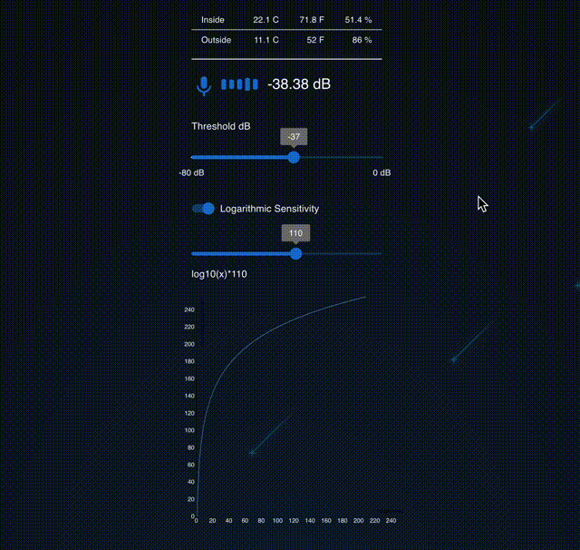

DEMO: [https://nomastickles.github.io/pi-monitor/](https://nomastickles.github.io/pi-monitor/)

## What does this do

This is a python + react ui audio monitoring tool (indicative of baby monitoring tools that visually show loudness of a room) using a raspberry pi, usb microphone, and Philips Hue Bridge lights system.

The more sound the microphone picks up, the brighter the connected smart lights shine with sensitivity and base loudness adjustments options.

## Tools Used

- rpi + usb microphone
- philips hue bridge light system on same local network as rpi
- DHT22 temperature + humidity sensor

## Setup

```sh

# clone the repo

chmod +x setup.sh && \
  chmod +x start.sh && \
  ./setup.sh

# then set your mic index and other options

./start.sh
```

## ./backend/.env

APP_SECRET = simple not very secure way to gate all flask routes in your network
BRIDGE_USERNAME = username from Hue bridge
BRIDGE_HOST=http://192.168.99.99
WEATHER_API_USER_AGENT_SECRET = used with api.weather.gov to get outside metrics
example: "(pi-monitor, your@email.com)"

## Phillips Hue bridge stuff

https://developers.meethue.com/develop/get-started-2/

You'll need to create a username and add to ./backend/.env

## (optional) api.weather.gov stuff

Please see https://www.weather.gov/documentation/services-web-api

Example cron:

```sh
2 * * * * python3 /home/pi/pi-monitor/backend/get_outside_atmosphere.py --weather-api-url https://api.weather.gov/gridpoints/SEW/130,68/forecast/hourly >> /tmp/pi-monitor-atmosphere-outside.log 2>&1

```

## TODO

- change .env values to these to command line args / exported values in start.sh
- unify data file values types/constants frontend + backend
- count nearby network mac addresses with Airodump-ng and save to file
- connect data values in /tmp to Prometheus metrics system

## Resources + Help

https://github.com/csteinmetz1/pyloudnorm

https://github.com/pklaus/pklaus/tree/master/pklaus/audio/level

https://github.com/tigoe/hue-control

https://github.com/adafruit/Adafruit_CircuitPython_DHT/blob/main/examples/dht_simpletest.py

https://www.weather.gov/documentation/services-web-api
