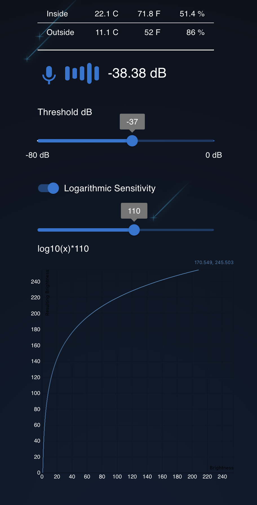

## @reduxjs/toolkit + useReducer + useContext = 🌈💥

### How to change the frontend on the pi:

Flask frontend is already built and saved within "./backend/static". However if you want to further augment your experience here's the deal:

1.  clone this repo in your remote device (rpi)
2.  clone to your local frontend dev machine
3.  from local dev `yarn start` and do some dev'ing
4.  once you are happy use `build:copy-files-to-flask` (example:)

```sh
MAGIC_USER=pi MAGIC_HOST=192.168.1.123 yarn build:copy-files-to-flask
```

`build:copy-files-to-flask` builds the JS and updates the flask template with new js, css, etc

Resources:

https://github.com/mui/material-ui

https://mui.com/material-ui/react-slider/
